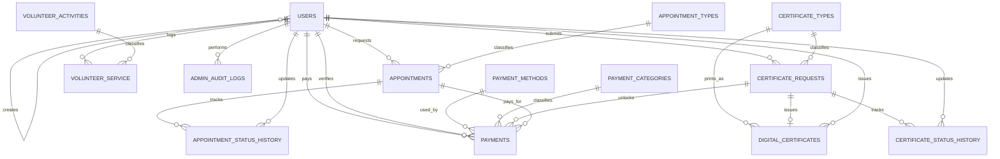

# E-Parish ERD and Normalization Notes

This database is designed so phpMyAdmin Designer can draw the ERD from real primary keys and foreign keys. Open the system once after deployment so the migrations run, then go to phpMyAdmin, select the `eparish_db` database, and open **Designer**.

## Normalized ERD

## Key Tables

`users`: member and admin accounts. `created_by` is a self-referencing foreign key for admin-created accounts.

`appointment_types`, `certificate_types`, `volunteer_activities`, `payment_methods`, `payment_categories`: lookup/reference tables. These remove repeated text values from transaction tables.

`appointments`, `certificate_requests`, `volunteer_service`, `payments`: transaction tables. They store request-specific data and point to lookup tables by ID.

`digital_certificates`: one issued certificate per certificate request.

`appointment_status_history`, `certificate_status_history`, `admin_audit_logs`: tracking tables for admin actions and request status changes.

## Normalization Applied

1NF: Each field contains one atomic value. Repeating service names, certificate names, volunteer activities, and payment methods are not stored as lists or mixed text.

2NF: Transaction tables use single-column primary keys, and each non-key column describes the whole row. Example: appointment date and time depend on `appointments.id`, while the appointment type name belongs in `appointment_types`.

3NF: Descriptive lookup data is separated from request/payment records. Example: `payments.payment_method_id` points to `payment_methods.id`, so the method name is stored once and updated in one place.

## phpMyAdmin Designer Checklist

1. Confirm all tables use the InnoDB engine.
2. Open `eparish_db` in phpMyAdmin.
3. Choose **Designer** to view the ERD.
4. Arrange lookup tables on the left and transaction tables in the center.
5. Keep history/audit tables on the right or bottom.
6. Export or screenshot the Designer view for presentation.

The ERD should match the actual database after migration `2026_05_11_000005_normalize_database_for_erd.php` runs.
